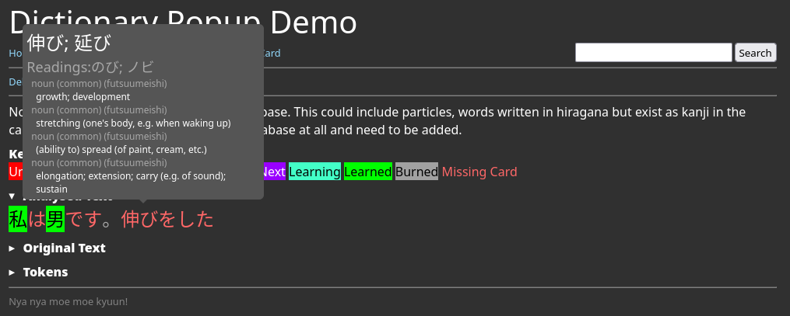

# Change Log

## 0.3.0 - 2023-04-18
### Fix page title for kanjifrequency page

## 0.2.9 - 2023-04-18
### Add known kanji percentage page
The `/kanjifrequency` shows how many kanji you will be able to read for various online sources, based on the frequency of the kanji in the sources and the number of kanji you know.

## 0.2.8 - 2023-04-17
### Add schedule page
The `/schedule` page shows how many cards will be due for review in each hour for the next 48 hours.

## 0.2.7 - 2023-04-17
### Fix bug with tagging suspended cards in the Up Next queue
When a card was in the Up Next queue, and was suspended, the card would not be removed from the queue.

### Fix bug with adding unlearned components to Up Next cards
When a card was in the Up Next state and an unlearned component was added to it, the card would not be reevaluated to Queued to Learn

## 0.2.6 - 2023-04-16
### Fix bug with links in dictionary entries
When a dictionary entry had no kanji, and only showed the reading, the link to the dictionary entry would not work.

## 0.2.5 - 2023-04-16
### Add Simulate Page Link
Simulation page was previously only accessible directly via the URL. Now there is a link to it on the home page, as well as inputs for the recall rate and number of new cards per day to simulate.

## 0.2.4 - 2023-04-16
### Existing Cards Show on Dictionary Entry
When viewing a dictionary entry, you can see if there are any cards that already exist for that dictionary entry.

## 0.2.3 - 2023-04-16
### Add New Cards from Dictionary Entry
When viewing a dictionary entry, you can add a new card pre-populated with the dictionary entry's information.

## 0.2.2 - 2023-04-16
### Alternate Writings
Add ability to have alternate writings for a card. This is useful for cards that have a different writing than the one that would be used in a sentence. E.g. 達 vs たち.

### Other
- Add an underline to the word being hovered over in the text analysis page
- Sort the text entries in the text analysis overview by name
- Add readings in text analysis page for words that are already in the card database

## 0.2.1 - 2023-04-16
### Dictionary Search Page
`/dictionarysearch` is now a thing. It's a page that allows you to search for words in the dictionary.

## 0.2.0 - 2023-04-15
### Dictionary Popup
The text analysis page now has a dictionary popup for words that do not exist as cards.

