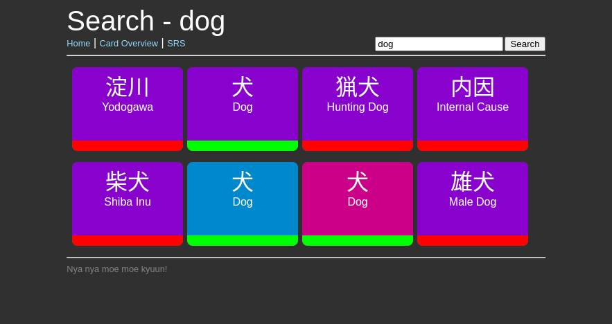

# Moe Kyuniversity

Learn your Japanese vocabulary with spaced repetition. Set up dependencies between cards, and learn them in the correct order.

You should use Wanikani to learn instead of this project. Wanikani is great. This project is not.

**NOT FOR USE YET.**

**Project is still in early development.**

**Currently there is no way to use this program without manually creating you own data files.**

## The Algorithm
Moe Kyuniversity uses an extremely simplified SRS algorithm.

A card is either in the learning stage, or the learned stage. The learning interval is initially set to 3 hours. Each time the card is answered correctly, the interval is doubled. If the card is answered incorrectly, the interval is reset to 3 hours, however the card's original interval is preserved. Once the interval is greater than 24 hours, the card is moved to the learned stage with the original interval divided by 2.

Example:
1. New card is learned. Interval is 3 hours.
2. Card is answered correctly. Interval is doubled to 6 hours.
3. Card is answered correctly. Interval is doubled to 12 hours.
4. Card is answered correctly. Interval is doubled to 24 hours. Card is now considered "learned".
5. Card is answered correctly. Interval is doubled to 48 hours.
6. Card is answered correctly. Interval is doubled to 96 hours.
7. Card is answered incorrectly. Interval is reset to 3 hours. Original interval is preserved and divided by two (48 hours). Actual interval being used is 3 hours.
8. Card is answered correctly. Interval is doubled to 6 hours.
9. Card is answered correctly. Interval is doubled to 12 hours.
10. Card is answered correctly. Interval is doubled to 24 hours. Card is now considered "learned" and the original interval is restored. Interval is now 48 hours.

When a card is in the "learning" stage, it is not considered known enough to unlock other cards that depend on it.

## Docker Compose
```yaml
version: '3'

services:
  moekyuniversity:
    image: moekyuniversity
    container_name: moekyuniversity
    restart: unless-stopped
    ports:
      - "8080:8080"
    volumes:
      - ./data:/app/data
```

## Screenshots


Search Interface


See dependency tree for a card


Add custom dependencies to a card. "Sphere" was added as a dependency to "Bullet".


SRS Interface